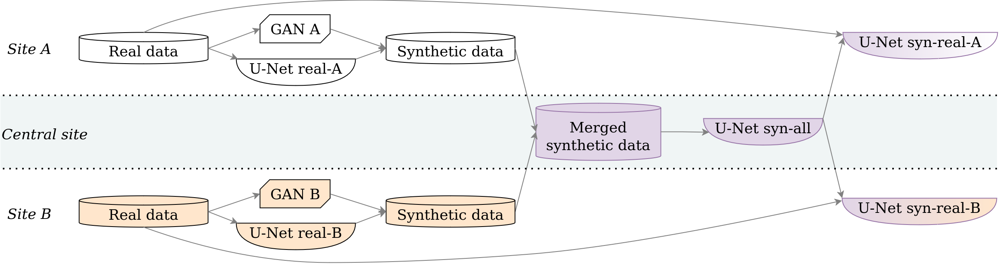

# HyFree-S3 

[Hyperparameter-Free Medical Image Synthesis for Sharing Data and Improving Site-Specific Segmentation](https://arxiv.org/abs/2404.06240)

**TL;DR** Practical medical image synthesis and sharing method that requires no hyperparameter tuning. Segmentation. 2D models. Built upon nnU-Net and StyleGANv2. Includes a technique to prevent sharing of memorized data.

<p align="middle">
    
</p>

## Abstract

Sharing synthetic medical images is a promising alternative to sharing real images that can improve patient privacy and data security. 

To get good results, existing methods for medical image synthesis must be manually adjusted when they are applied to unseen data. To remove this manual burden, we introduce a **Hy**perparameter-**Free** distributed learning method for automatic medical image **S**ynthesis, **S**haring, and **S**egmentation called **HyFree-S3**. 

For three diverse segmentation settings (pelvic MRIs, lung X-rays, polyp photos), the use of HyFree-S3 results in improved performance over training only with site-specific data (in the majority of cases). The hyperparameter-free nature of the method should make data synthesis and sharing easier, potentially leading to an increase in the quantity of available data and consequently the quality of the models trained that may ultimately be applied in the clinic.

## Setup

Create & activate a conda environment:

```
conda env create --file env_autoshare.yml
conda activate autoshare
```

Install the nnunetv2_mod:

```bash
cd nnunetv2_mod
pip install -e .
```

Set environmental variables

```
export OMP_NUM_THREADS=4
export OPENBLAS_NUM_THREADS=4
export VECLIB_MAXIMUM_THREADS=4
export NUMEXPR_NUM_THREADS=4
export MKL_NUM_THREADS=1
ulimit -n 500000
```

## Running experiments

### Data

The datasets should be converted into the nnU-Net format. The appropriate scripts are in the ``dataset/preprocess_new`` directory.

Since we want to do a 5-fold cross-validation with test sets (3 folds train, 1 fold val, 1 fold test), we cannot create a single nnU-Net dataset for each dataset. Instead, we create a separate nnU-Net dataset for each train-val-test split.

#### Lung X-rays (QaTa-COV19)

Subdir: ``dataset/preprocess_new/qata``

``name_consistently.py`` to select a subset of images with known patient IDs and to rename them for convenience.

``qata_to_nnunet_folds.py`` to convert to the nnU-Net format.

``add_scaling_folds.py`` to create more folds for the scaling experiment (specifically, to pretrain not on all data, but only on 2 or 4 sites (8 sites correspond to 'all', so no need to create that)).

``create_federated_datasets.py`` to create the datasets for the FederatedAveraging experiment.

#### Polyp photos (HyperKvasir, CVC-ClinicDB)

Subdir: ``dataset/preprocess_new/polyp``

``name_consistently.py`` to split CVC-ClinicDB into patients and to rename images in both CVC-ClinicDB and HyperKvasir for convenience.

``merge_prepared.py`` to merge the prepared CVC and HyperKvasir datasets into one Polyp dataset.

``polyp_to_nnunet_folds.py`` to convert to the nnU-Net format.

``create_federated_datasets.py`` to create the datasets for the FederatedAveraging experiment.

#### Cervix MRIs (private LUMC dataset)

Note that this dataset is not publicly available, the commands are provided for internal reproduction (they could also be used as a reference to preparing 3D data for HyFree-S3, though a lot of it is specific to our dataset).

Subdir: ``dataset/preprocess_new/cervix``

``find_scanners.py`` to store information on which scanner was used to acquire each image. Used to split into two sites in a non-iid way.

``csv_other_part.py``: the dataset comes in two parts. One of them has a .csv that requires additional processing.

``merge_daedalus.py`` to merge the two parts of the dataset into one.

``cervix_dicom_utils.py``: utils for converting DICOM files to .nii.gz.

``cervix_to_nnunet_folds.py`` to convert to the nnU-Net format.

``create_federated_datasets.py`` to create the datasets for the FederatedAveraging experiment.

### Main experiments
```
python run_nnunet.py --config-name=qata_000 ++data.fold=0
```

Configs for the experiments are in the ``config/nnunet`` dir. Note that configs need to be modified to refer to your paths and the names/IPs of your servers (for Ray).

### Scaling experiments

To run the scaling experiments, use the ``run_scaling.py`` with the ``nnunet/qata_001`` config.

### Baselines

To run FederatedAveraging with nnU-Net, use ``run_federated.py`` instead of ``run_nnunet.py``. The appropriate configs are in the ``config/federated`` directory.

To run DSL, use our fork: https://github.com/AwesomeLemon/DSL_All_Code

## Acknowledgements

We build upon [nnU-Net](https://github.com/MIC-DKFZ/nnUNet) and [StyleGANv2 with differentiable augmentations](https://github.com/mit-han-lab/data-efficient-gans), we thank the authors of these projects for making their code available.